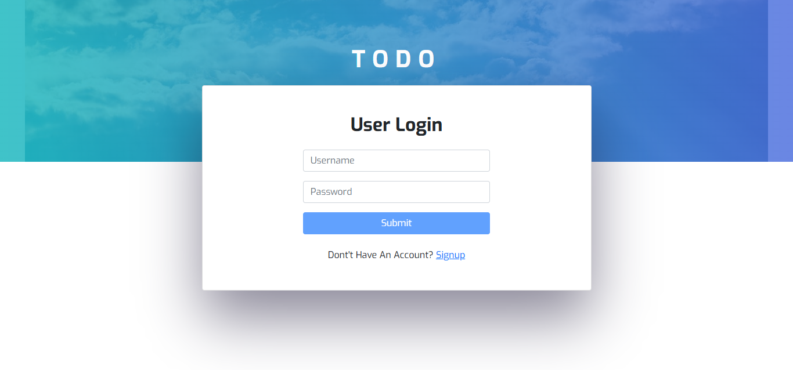
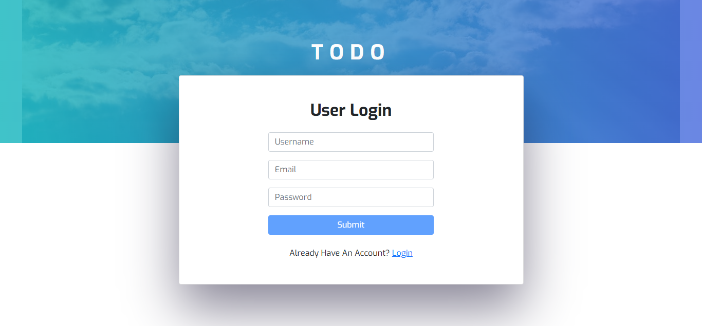
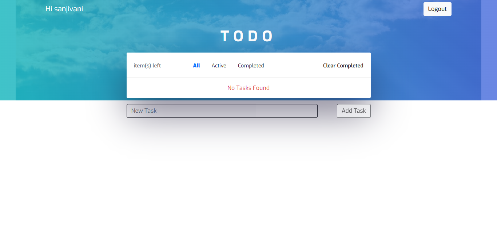
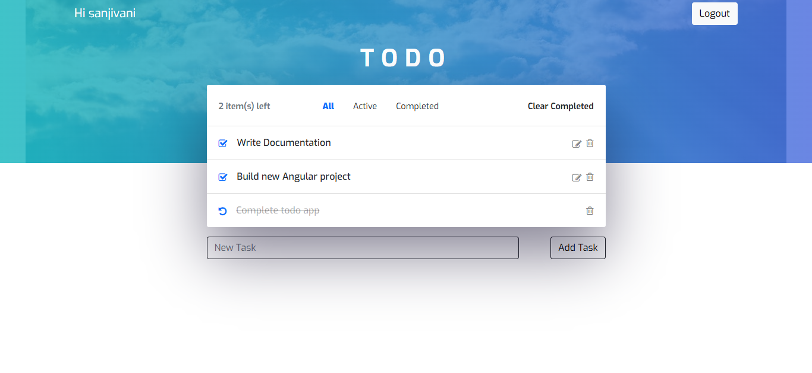
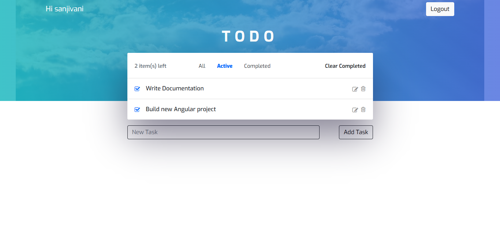
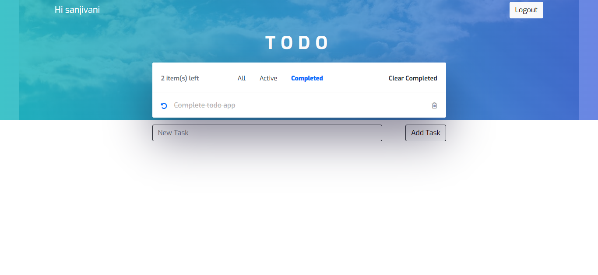
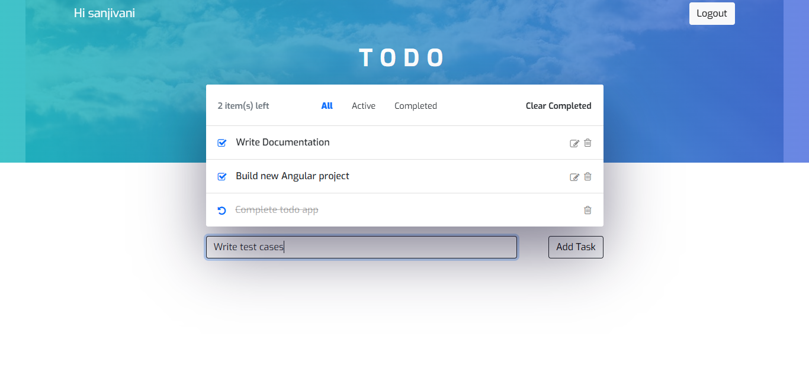

# 📌 Todo Application

A simple and dynamic ToDo application with full CRUD (Create, Read, Update, Delete) functionalities. This application allows users to manage their tasks efficiently.

</> Front-end: Built using Angular  
🌐 Back-end: Powered by Node.js  
🛢️ Database: Data stores in MySQL  


## 🚀 Features

✅ Create, update, and delete tasks  
✅ Mark tasks as completed or pending  
✅ User-friendly and responsive UI  
✅ Persistent storage for tasks  
✅ REST API integration  


## 📁 Project Structure

```
.
├── Backend_Node/ - Express server that provides API routes and serves front-end
│ ├── app.js - Adds middleware to the express server
│ ├── connection.js - Provides connection object to connect to database
│ ├── routes/ - Handles API calls for routes
│ ├── controllers/ - Handles logic for APIs
├── Frontend_Angular/
|  └──src - Angular front-end
│   └── app - Angular main root module
│     └── app.module.ts - Angular root module
│     ├── components - Angular main components
│     ├── auth - Angular route guards
│     ├── shared - Angular shared constants
|     ├── services - Angular services for HTTP calls
└── README.md
```


## ⚙️ Installation & Setup

### 1️⃣ Clone the Repository

Clone repository: ``` https://github.com/sanjivanisharma/todo-application.git ```

### 2️⃣ Install Dependencies

Run ``` npm install ``` to install all the required packages in backend and frontend.

### 3️⃣ Start the Application

Run ``` npm start ``` to start backend.
Run ``` ng serve --open ``` to start frontend.

The front-end is served on http://localhost:4200/ and the back-end on http://localhost:3500/.


## 🖥️ Demo














